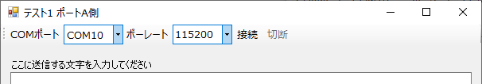

# SerialPortToolBar
シリアル通信ツールバー (for Windows Forms)

 

## SerialPortToolStrip
シリアル通信ツールバーのコントロールです。PortToolStripクラスを継承しています。

### イベント
|  名前  |  説明  |
| ---- | ---- |
|  Opened  |  シリアルポートが開いた時  |
|  Closed  |  シリアルポートが閉じた時  |
|  DataReceived  |  シリアルポートがデータを受信した時  |

### プロパティ
|  名前  |  説明  |
| ---- | ---- |
|  Port  |  シリアルポート (SerialPortクラスのオブジェクト)  |

### メソッド
|  名前  |  説明  |
| ---- | ---- |
|  Begin(iniFileName, section)  |  初期化処理。  フォームの開始時(Loadイベント)に呼んでください。  iniFileName: 設定INIファイルのパス(省略可) section: 設定INIファイルのセクション名(省略可) |
|  End()  |  終了処理。  フォームの終了時(FormClosingイベント)に呼んでください。 |

 

## SerialPacketReceiver
シリアル通信のパケット受信器クラスです。アスキー形式またはバイナリー形式のパケットに対応します。

- アスキー形式：開始コードと終了コードを持つアスキーキャラクタのパケット
- バイナリー形式：開始ヘッダとパケット長指定子を持つバイナリーデータのパケット

### イベント
|  名前  |  説明  |
| ---- | ---- |
|  PacketReceived  |  パケットを受信した時。 イベントドリブンで受信する場合に設定する。 WaitPacket()メソッドを用いる場合は設定しない。  |

### プロパティ
|  名前  |  説明  |
| ---- | ---- |
| PollingInterval |  受信ポーリング周期[ミリ秒]  |
| PacketMode | パケットモード。バイナリー形式かアスキー形式か。 |
| TimeOut |  パケットタイムアウト時間[ミリ秒]。 パケット先頭バイト受信からこの時間を経過すると受信中のデータは破棄されます。  |
| StartCode |  パケット開始コード (アスキーモード用)  |
| EndCode |  パケット終了コード (アスキーモード用)  |
| Header | パケット開始ヘッダ (バイナリーモード用)  |
| LengthOffset | バイナリーモードのパケット長指定子(Length)の 先頭位置 (パケット先頭を0とする) |
| LengthWidth | バイナリーモードのパケット長指定子(Length)の バイト幅 (1または2) |
| LengthEndian | バイナリーモードのパケット長指定子(Length)の エンディアン(バイト幅が2のとき) |
| LengthExtra | バイナリーモードのパケット長指定子(Length)の追加値。 (パケットの全バイト数 - Length)の値を指定する。 |

### メソッド
|  名前  |  説明  |
| ---- | ---- |
| SerialPacketReceiver(port, maxSize) | コンストラクタ。 port: シリアルポート maxSize: パケットの最大バイト数 |
| WaitPacket(timeout) | パケット受信を待って取得する (ブロッキング)。 timeout: タイムアウト時間[ミリ秒] 戻り値: 受信したパケットのバイト配列 |
|  GetPacket()  |  受信したパケットを取得する (ノンブロッキング)。 Start()で受信スレッドを開始しておき、PacketReceivedイベントでこのメソッドを呼びます。 戻り値: 受信したパケットのバイト配列 |
|  Start()  |  パケット受信スレッドを開始します。 |
|  Stop()  |  パケット受信スレッドを停止します。 フォーム/アプリ終了時までに停止しないとスレッドがゾンビ化します。 |

 

## SerialPortExtensions
SerialPortクラスに拡張メソッドを提供します。

### メソッド
|  名前  |  説明  |
| ---- | ---- |
| WriteBytes(byte[] data) | バイト配列を送信します。 |
| WriteChars(char[] data) | キャラクタ配列を送信します。 |
| WriteByte(byte data) | バイトデータを送信します。 |
| WriteChar(char data) | キャラクタデータを送信します。 |
| byte[] ReadBytes() | 受信データをバイト配列として取得します。 |
| char[] ReadChars() | 受信データをキャラクタ配列として取得します。 |
