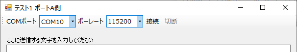

# SerialPortToolStrip
シリアル通信ツールバーのコントロールです。ToolStripクラスを継承しています。

## イベント
|  名前  |  説明  |
| ---- | ---- |
|  Opened  |  シリアルポートが開いた時  |
|  Closed  |  シリアルポートが閉じた時  |
|  DataReceived  |  シリアルポートがデータを受信した時  |

## プロパティ
|  名前  |  説明  |
| ---- | ---- |
|  Port  |  シリアルポート (SerialPortクラスのオブジェクト)  |

## メソッド
|  名前  |  説明  |
| ---- | ---- |
|  Begin(iniFileName, section)  |  初期化処理。  フォームの開始時(Loadイベント)に呼んでください。  iniFileName: 設定INIファイルのパス(省略可) section: 設定INIファイルのセクション名(省略可) |
|  End()  |  終了処理。  フォームの終了時(FormClosingイベント)に呼んでください。 |
|  Open()  |  シリアルポートを開きます。接続ボタンを押すのと同じ動作です。 |
|  Close()  |  シリアルポートを閉じます。切断ボタンを押すのと同じ動作です。 |
